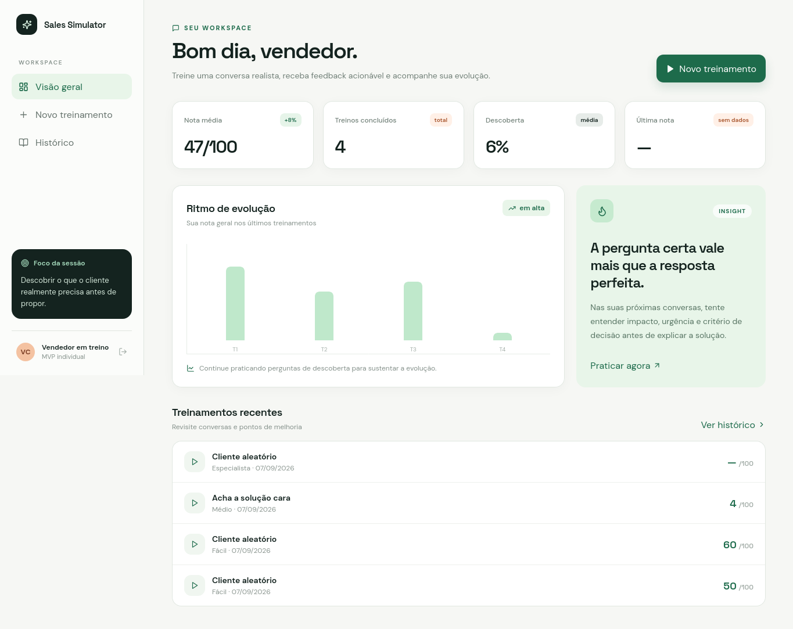
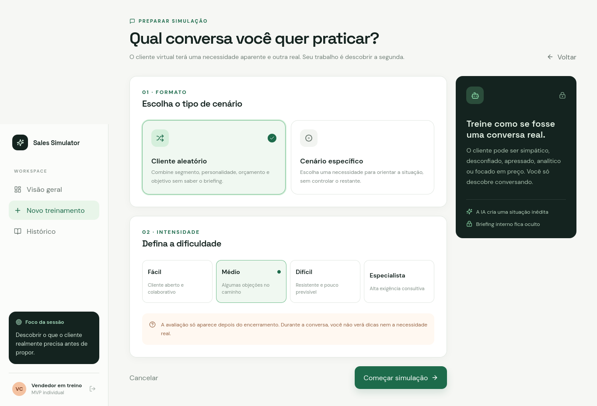
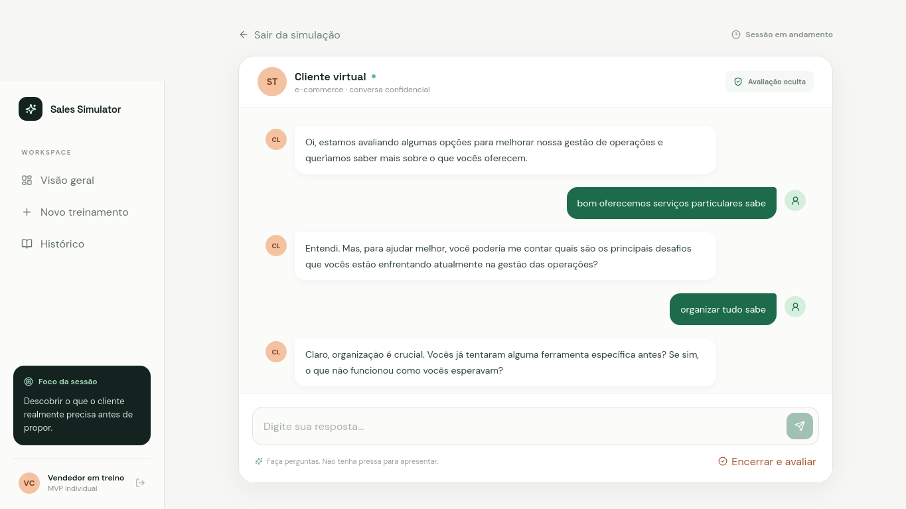

# Sales Simulator

Aplicação web para praticar conversas de vendas consultivas com clientes virtuais, receber uma avaliação após a simulação e acompanhar a evolução por meio do histórico e de métricas de desempenho.

> Este documento descreve o estado identificado no repositório em setembro de 2026. As funcionalidades são consideradas implementadas quando há evidência correspondente no código; os screenshots documentam o estado visual fornecido no próprio projeto.

## Sobre o projeto

O Sales Simulator permite iniciar treinamentos de vendas em cenários gerados por inteligência artificial. O usuário escolhe entre um cliente aleatório ou um cenário orientado por uma necessidade específica, define a dificuldade e conduz a conversa por texto. Ao encerrar, a aplicação solicita uma avaliação da conversa e apresenta notas, pontos positivos, oportunidades de melhoria, erros, momentos críticos, respostas alternativas e uma recomendação para o próximo treinamento.

O código identifica o usuário da interface como um vendedor em treinamento e apresenta a aplicação como um workspace individual. O repositório não contém uma especificação adicional de público, empresa ou processo comercial além desse contexto.

## Funcionalidades

### Implementadas no código

- [x] Dashboard com nota média, treinos concluídos, média de descoberta e última nota.
- [x] Visualização do ritmo de evolução e de treinamentos recentes.
- [x] Criação de treinamento com modo aleatório ou cenário específico.
- [x] Seleção de dificuldade: fácil, médio, difícil ou especialista.
- [x] Lista de necessidades disponíveis para cenários específicos.
- [x] Geração de cenários por um provedor de IA.
- [x] Conversa textual entre o vendedor e o cliente virtual.
- [x] Persistência do cenário, sessão e mensagens.
- [x] Encerramento da sessão e avaliação automática da conversa.
- [x] Exibição da nota geral, notas por dimensão, pontos positivos, melhorias, erros, momentos críticos, respostas melhores e próxima recomendação.
- [x] Histórico de treinamentos com acesso às avaliações.
- [x] Tema claro configurado como padrão e componentes responsivos.
- [x] Tratamento de rota inexistente por uma página `NotFound`.

### Identificadas nos screenshots

- [x] Navegação lateral com as opções **Visão geral**, **Novo treinamento** e **Histórico**.
- [x] Dashboard com cartão de insight e gráfico de evolução.
- [x] Tela de preparação com cartões de formato e dificuldade.
- [x] Tela de conversa com cliente virtual, mensagens alternadas e campo de resposta.
- [x] Indicação visual de que a avaliação permanece oculta durante a conversa.

### Em desenvolvimento ou preparados para integração

- O código contém classes `AnthropicProvider` e `GeminiProvider`, mas seus métodos lançam erro indicando que são integrações futuras. O provedor efetivamente selecionado por `getAIProvider()` é o `OpenAIProvider`.
- `Map.tsx` contém um componente de mapa preparado para uma integração com Google Maps via proxy, mas não há evidência de uso desse componente nas telas principais analisadas.
- O arquivo `AI_CUSTOMER_V2_HANDOFF.md` registra contexto técnico adicional, mas não transforma funcionalidades não utilizadas em funcionalidades disponíveis na aplicação.

## Interface

Os screenshots estão versionados em `imagens-readme/` e são referenciados diretamente pelos caminhos relativos abaixo.

### Dashboard

A tela inicial apresenta o workspace do vendedor, indicadores de desempenho, ritmo de evolução, um insight e a lista de treinamentos recentes.



### Preparação da simulação

A tela de novo treinamento permite escolher o formato do cenário e a intensidade da conversa antes de iniciar a simulação.



### Conversa com o cliente virtual

A tela de treinamento exibe o cliente virtual, o histórico da conversa, o campo para envio de respostas e a ação de encerrar e avaliar a sessão.



## Arquitetura

O projeto utiliza uma aplicação full-stack TypeScript com frontend React servido pelo backend Express. O Vite é usado no desenvolvimento e na construção do frontend. A comunicação entre frontend e backend utiliza tRPC com `httpBatchLink`, e as operações de dados são implementadas no servidor por meio do Drizzle ORM.

### Organização principal

```text
sales-simulator/
├── client/
│   ├── index.html
│   ├── public/
│   └── src/
│       ├── components/
│       ├── contexts/
│       ├── hooks/
│       ├── lib/
│       ├── pages/
│       ├── App.tsx
│       ├── index.css
│       └── main.tsx
├── server/
│   ├── _core/
│   ├── ai/
│   ├── db.ts
│   ├── routers.ts
│   └── *.test.ts
├── shared/
│   ├── _core/
│   ├── const.ts
│   └── types.ts
├── drizzle/
│   ├── schema.ts
│   ├── relations.ts
│   └── *.sql
├── scripts/
├── imagens-readme/
├── package.json
├── pnpm-lock.yaml
├── tsconfig.json
├── vite.config.ts
└── vitest.config.ts
```

### Fluxo técnico

1. `client/src/main.tsx` configura React Query, o cliente tRPC e o envio de credenciais.
2. `client/src/App.tsx` registra as rotas com `wouter`.
3. As páginas chamam procedimentos tRPC definidos em `server/routers.ts`.
4. O backend cria ou consulta cenários, sessões, mensagens, avaliações e métricas por meio de `server/db.ts`.
5. `server/ai/provider.ts` chama o provedor de IA configurado para gerar cenários, responder à conversa e avaliar o treinamento.
6. O resultado da avaliação é persistido e consumido pelas telas de avaliação, dashboard e histórico.

### Rotas da interface

| Rota | Página | Responsabilidade |
|---|---|---|
| `/` | `Home` | Página inicial. |
| `/dashboard` | `Dashboard` | Indicadores, evolução, insight e treinamentos recentes. |
| `/new-training` | `NewTraining` | Configuração e início de um treinamento. |
| `/training/:id` | `TrainingChat` | Conversa com o cliente virtual. |
| `/training/:id/evaluation` | `Evaluation` | Resultado da avaliação da sessão. |
| `/history` | `History` | Histórico de treinamentos e notas. |
| `/404` | `NotFound` | Rota não encontrada. |

### Procedimentos tRPC principais

| Grupo | Procedimentos |
|---|---|
| `simulation` | `focusNeeds`, `start`, `get`, `send`, `finish`, `evaluation` |
| `history` | `list`, `summary` |
| `auth` | `me`, `logout` |

## Tecnologias

| Tecnologia | Finalidade |
|---|---|
| TypeScript | Tipagem e desenvolvimento do frontend e backend. |
| React 19 | Construção da interface. |
| Vite | Servidor de desenvolvimento e build do frontend. |
| Express | Servidor HTTP da aplicação. |
| tRPC | Comunicação tipada entre frontend e backend. |
| TanStack React Query | Cache e execução das consultas tRPC no frontend. |
| Wouter | Roteamento da interface. |
| Drizzle ORM | Acesso tipado ao banco de dados MySQL. |
| MySQL2 | Driver de conexão com MySQL. |
| Tailwind CSS | Estilização da interface. |
| Radix UI | Componentes de interface acessíveis. |
| Lucide React | Ícones da interface. |
| Recharts | Visualizações gráficas do dashboard. |
| Vitest | Testes automatizados. |
| Zod | Validação dos dados de entrada e dos schemas. |
| OpenAI API | Geração de cenários, respostas do cliente e avaliações. |

## Pré-requisitos

- Node.js compatível com as dependências do projeto.
- `pnpm` 10.4.1, conforme o campo `packageManager` de `package.json`.
- Um banco MySQL acessível por meio de `DATABASE_URL`.
- Uma chave da OpenAI em `OPENAI_API_KEY` para os fluxos de IA.
- `JWT_SECRET` para a configuração de cookies/sessão do servidor.

A variável `PORT` é opcional; o servidor usa `3000` como padrão quando ela não está definida. O código não contém um arquivo `.env.example` no estado atual do repositório.

## Instalação

```bash
git clone https://github.com/Kingnike1/sales-simulator.git
cd sales-simulator
pnpm install
```

Configure as variáveis de ambiente antes de executar o servidor. Em seguida, prepare o banco de dados com o script existente:

```bash
pnpm db:push
```

O script `db:push` gera as migrações Drizzle e executa `scripts/db-push.ts`. Ele exige `DATABASE_URL`.

## Variáveis de ambiente

| Variável | Obrigatória | Descrição |
|---|---|---|
| `DATABASE_URL` | Sim para persistência e `db:push` | URL de conexão com o MySQL. |
| `OPENAI_API_KEY` | Sim para gerar cenários, conversar e avaliar | Chave usada apenas no servidor para acessar a API da OpenAI. |
| `JWT_SECRET` | Sim para a configuração de sessão/cookies | Segredo usado pela configuração de cookies da aplicação. |
| `OPENAI_MODEL` | Não | Modelo da OpenAI; o padrão no código é `gpt-4o-mini`. |
| `PORT` | Não | Porta HTTP; o padrão no código é `3000`. |
| `NODE_ENV` | Não | Define o modo de execução; os scripts já definem `development` ou `production`. |
| `VITE_FRONTEND_FORGE_API_KEY` | Não identificada como necessária ao fluxo principal | Chave lida pelo componente de mapa. |
| `VITE_FRONTEND_FORGE_API_URL` | Não identificada como necessária ao fluxo principal | URL opcional do proxy usado pelo componente de mapa. |

Nunca versionar chaves, tokens, senhas ou valores reais de produção.

## Executando o projeto

### Desenvolvimento

```bash
pnpm dev
```

O servidor é iniciado pelo arquivo `server/_core/index.ts`. O código usa a porta indicada por `PORT` ou `3000` como fallback. Com a porta padrão, acesse `http://localhost:3000`.

### Produção

Gere os artefatos e inicie o servidor:

```bash
pnpm build
pnpm start
```

O build cria o frontend em `dist/public` e empacota o servidor em `dist/index.js`. O comando `start` exige que o build tenha sido executado anteriormente.

## Testes

O framework configurado é o Vitest. Os testes existentes no repositório incluem autenticação/logout, independência entre sessões e fluxo de simulação.

```bash
pnpm test
```

Também existe um script de verificação de tipos:

```bash
pnpm check
```

O arquivo `scripts/smoke-flow.ts` implementa um fluxo de fumaça que cria uma sessão, envia uma mensagem, finaliza a conversa e verifica a persistência. Ele depende de um banco configurado e de uma chave de IA. Não há um script `package.json` dedicado para executá-lo no estado atual.

## Estrutura do projeto

| Caminho | Responsabilidade |
|---|---|
| `client/src/App.tsx` | Composição global e definição das rotas. |
| `client/src/pages/` | Telas de início, dashboard, novo treinamento, conversa, avaliação e histórico. |
| `client/src/components/AppShell.tsx` | Layout com navegação lateral e identidade do workspace. |
| `client/src/lib/trpc.ts` | Cliente React do AppRouter tRPC. |
| `server/routers.ts` | Procedimentos de autenticação, simulação e histórico. |
| `server/db.ts` | Consultas e mutações de persistência. |
| `server/ai/provider.ts` | Contrato de provedor e integração efetiva com OpenAI. |
| `server/_core/index.ts` | Inicialização do Express, Vite e servidor HTTP. |
| `server/_core/env.ts` | Leitura das variáveis de ambiente. |
| `drizzle/schema.ts` | Tabelas MySQL e tipos inferidos pelo Drizzle. |
| `drizzle/*.sql` | Migrações versionadas. |
| `scripts/db-push.ts` | Aplicação da configuração/migrações do banco. |
| `scripts/smoke-flow.ts` | Verificação manual automatizada do fluxo completo. |
| `imagens-readme/` | Screenshots usados nesta documentação. |

## Fluxo da aplicação

```text
Vendedor
   ↓
Dashboard ou Novo treinamento
   ↓
Escolha do formato e da dificuldade
   ↓
Geração do cenário por IA
   ↓
Conversa textual com o cliente virtual
   ↓
Encerramento da sessão
   ↓
Avaliação da conversa por IA
   ↓
Persistência da avaliação e das métricas
   ↓
Dashboard, avaliação detalhada e histórico
```

Durante a conversa, o briefing interno do cenário é mantido no servidor e a interface informa que a avaliação fica oculta até o encerramento. O backend limita o histórico enviado ao provedor de respostas às últimas mensagens consideradas no contexto do diálogo.

## Como utilizar

1. Acesse o dashboard e selecione **Novo treinamento**.
2. Escolha **Cliente aleatório** para combinar os parâmetros do cenário ou **Cenário específico** para orientar a situação por uma necessidade disponível.
3. Selecione uma dificuldade entre fácil, médio, difícil e especialista.
4. Inicie a simulação.
5. Leia a mensagem do cliente e envie respostas pelo campo de texto.
6. Faça perguntas de descoberta e conduza a conversa sem depender de dicas exibidas durante o exercício.
7. Selecione **Encerrar e avaliar**.
8. Consulte a avaliação e retorne ao dashboard ou ao histórico para acompanhar o desempenho.

## Principais componentes

| Componente | Localização | Responsabilidade |
|---|---|---|
| `AppShell` | `client/src/components/AppShell.tsx` | Layout compartilhado e navegação principal. |
| `ErrorBoundary` | `client/src/components/ErrorBoundary.tsx` | Tratamento de erros de renderização no frontend. |
| `ThemeProvider` | `client/src/contexts/ThemeContext.tsx` | Controle do tema da interface. |
| `Home` | `client/src/pages/Home.tsx` | Entrada da aplicação. |
| `Dashboard` | `client/src/pages/Dashboard.tsx` | Resumo de desempenho e treinamentos recentes. |
| `NewTraining` | `client/src/pages/NewTraining.tsx` | Seleção de formato, necessidade e dificuldade. |
| `TrainingChat` | `client/src/pages/TrainingChat.tsx` | Interação com o cliente virtual e envio de mensagens. |
| `Evaluation` | `client/src/pages/Evaluation.tsx` | Apresentação do resultado da sessão. |
| `History` | `client/src/pages/History.tsx` | Consulta de sessões anteriores. |
| `OpenAIProvider` | `server/ai/provider.ts` | Criação de cenários, respostas e avaliações via OpenAI. |

## APIs e integrações

A API interna é exposta pelo AppRouter tRPC e consumida pelo frontend por HTTP batch. Os procedimentos de simulação são usados para criar sessões, recuperar o bundle da sessão, trocar mensagens e gerar avaliações.

A integração externa confirmada no fluxo principal é a OpenAI. A aplicação envia instruções de sistema, contexto do cenário e transcrição da conversa para três operações: criação de cenário, resposta do cliente e avaliação estruturada. A chave é lida no servidor por `OPENAI_API_KEY`; ela não deve ser prefixada com `VITE_`.

O componente `client/src/components/Map.tsx` também contém integração preparada com um proxy de Google Maps, mas seu uso no fluxo principal não foi identificado. Não há endpoint público documentado no repositório além dos procedimentos tRPC.

## Banco de dados

O banco esperado é MySQL, acessado por Drizzle ORM e `mysql2`. O schema contém as seguintes tabelas:

| Tabela | Conteúdo |
|---|---|
| `users` | Dados básicos de usuário e informações de sessão. |
| `scenarios` | Modo, dificuldade, perfil do cliente, necessidades, orçamento, contexto e critérios de sucesso. |
| `training_sessions` | Sessões de treinamento e seu estado. |
| `messages` | Mensagens do vendedor e do cliente vinculadas a uma sessão. |
| `evaluations` | Nota geral, dimensões avaliadas, pontos positivos, melhorias, erros, momentos críticos e recomendação. |
| `performance_metrics` | Nota geral e notas de descoberta, objeções e fechamento. |

As tabelas `training_sessions`, `messages`, `evaluations` e `performance_metrics` possuem chaves estrangeiras para seus registros relacionados. As colunas JSON são armazenadas como texto, conforme `drizzle/schema.ts`.

## Scripts disponíveis

| Comando | Descrição |
|---|---|
| `pnpm dev` | Inicia o servidor em modo de desenvolvimento com `tsx watch`. |
| `pnpm build` | Compila frontend e backend para produção. |
| `pnpm start` | Inicia o bundle de produção em `dist/index.js`. |
| `pnpm check` | Executa o TypeScript sem emitir arquivos. |
| `pnpm format` | Formata os arquivos com Prettier. |
| `pnpm test` | Executa a suíte Vitest. |
| `pnpm db:push` | Gera migrações Drizzle e executa o script de atualização do banco. |

## Problemas conhecidos e pendências identificadas

- Não há `.env.example` versionado para orientar a criação do ambiente local.
- O provedor Anthropic está apenas preparado e não implementado.
- O provedor Gemini está apenas preparado e não implementado.
- O componente de mapa usa variáveis `VITE_*`, mas o uso efetivo no fluxo principal não foi identificado.
- A licença do projeto não foi identificada: não há arquivo `LICENSE` no repositório e não foi encontrada uma declaração de licença no `package.json`.
- A documentação técnica existente registra verificações anteriores de build, testes e banco, mas os comandos dependem das credenciais e serviços configurados no ambiente de execução.

## Roadmap

O roadmap formal não está definido no repositório. Há evidências de preparação para futuros provedores de IA, mas não há uma lista oficial de funcionalidades, prioridades ou prazos.

## Desenvolvimento

Para começar, instale as dependências com `pnpm install`, configure o MySQL e as variáveis de ambiente, execute `pnpm db:push` e inicie o servidor com `pnpm dev`. Durante o desenvolvimento, os principais pontos de entrada são `client/src/App.tsx`, `server/_core/index.ts`, `server/routers.ts`, `server/db.ts` e `server/ai/provider.ts`.

Antes de enviar alterações, execute `pnpm check` e `pnpm test`. Quando a mudança afetar o empacotamento, execute também `pnpm build`. O repositório contém configuração de Prettier e o script `pnpm format`.

## Git

O repositório contém o histórico e a configuração Git, mas não foi encontrada documentação versionada que defina uma estratégia de branches, convenção de commits ou fluxo obrigatório de revisão. Portanto, nenhuma convenção específica é afirmada nesta documentação.

## Licença

A licença não foi identificada no estado atual do projeto. Consulte os responsáveis pelo repositório antes de redistribuir o código.

## Screenshots

As imagens usadas neste README estão em `imagens-readme/`:

- [`tela1.png`](imagens-readme/tela1.png): dashboard.
- [`tela2.png`](imagens-readme/tela2.png): preparação de simulação.
- [`tela3.png`](imagens-readme/tela3.png): conversa com cliente virtual.

## Referências

[1]: https://github.com/Kingnike1/sales-simulator "Repositório do Sales Simulator"

A referência [1] aponta para o repositório que contém o código, as migrações e os screenshots descritos neste documento.
